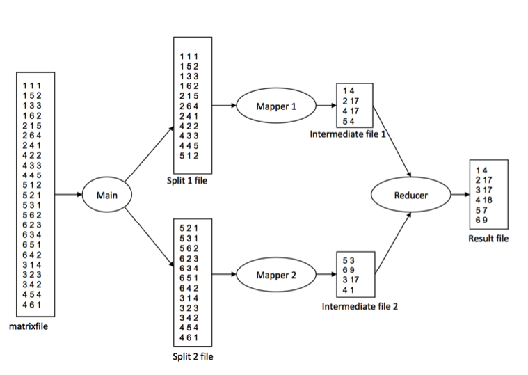

# Processes, IPC, and Threads
## CS342 Operating Systems – Spring 2020

A multi-process / multithreaded application that will perform matrix-vector multiplication for large matrices and vectors. 
More precisely, the application will multiply an _n_ x _n_ matrix **M** with a vector **v** of size _n_.

### To Build & Run

```
$ make
$ ./mv <matrixfile.txt> <vectorfile.txt> <result.txt> <number>
$ ./mvp <matrixfile.txt> <vectorfile.txt> <result.txt> <number>
$ ./mvt <matrixfile.txt> <vectorfile.txt> <result.txt> <number>
```

### MV.C - Processes (Matrix-Vector Multiplication) 

The main process reads the _matrixfile_ (which can be quite large) and partitions it into _K_ splits (each split is a file). The partitioning is as follows: 

Assume there are _L_ values (lines) in _matrixfile_. 
the first split contains the first _s_ = _L_ / _K_ (integer division, i.e., _L_ div _K_ ) values

After generating the split files, the main process creates _K_ child processes to process (map) the split files. These child processes will be called as **mapper processes** (mappers). Mappers runs and process their splits concurrently.

> Each mapper creates a partial result for the multiplication and writes out the partial result array into an intermediate output file

When all mappers finish, a **reducer process** (another child) started by the main process. 

 > The reducer process opens and read and process the intermediate files produced by the mappers. It reads the intermediate files and sums up the respective values corresponding to the same vector index. At the end, the result vector can be obtained (after processing all input files). The result vector will be printed out to the _resultfile_ in sorted order with respect to row numbers.

### MVP.C - IPC (with pipes)

Same program this time using pipes instread of use of intermediate files between mapper processes and reducer process. If there are _K_ mappers, then there will _K_ pipes created. Each pipe will be used for sending data from a mapper process to the reducer process. Each mapper will put data in a different pipe. Reducer process will get data from all pipes. The main process will generate split files. After split files are generated, the child processes will start working on then. No intermediate files will be generated.

### MVT.C - Threads

Same program using threads this time. There will be _K_ mapper threads and 1 reducer thread created. Global variables (structures like arrays or linked lists) will be used to pass information between mapper threads and the reducer thread. Again the main thread will generate split files. After split files generated, mapper threads will start working on them. There will be no intermediate files. For this part, mappers and reducer will **not access shared structures concurrently**. Reducer thread started after mappers finish.


### Example - MV.C

The figure below shows the results:



Let us consider an example for *MV.C*. Assume we have a 6x6 matix and a vector of size 6 , as follows.

```
Matrix M
X 1 2 3 4 5 6
1 1 0 3 0 2 2
2 5 0 0 1 0 4
3 4 3 0 2 0 0
4 0 2 3 5 4 1
5 2 1 1 0 0 2
6 0 3 4 2 1 0
```
```
Vector v
1 2
2 1
3 0
4 3
5 0
6 1
```
Assume there are 2 mappers. The matrixfile will be partitioned into 2 split
files. Split 1 file will have the first 11 lines from matrixfile and split 2 file will have
the remaining 12 lines from matrixfile. The first mapper will process split 1 file and
the second mapper will process split 2 file. Reducer will read the
intermediate files and will aggregate the values corresponding to the same row
numbers, and finally will generate the _resultfile_ 